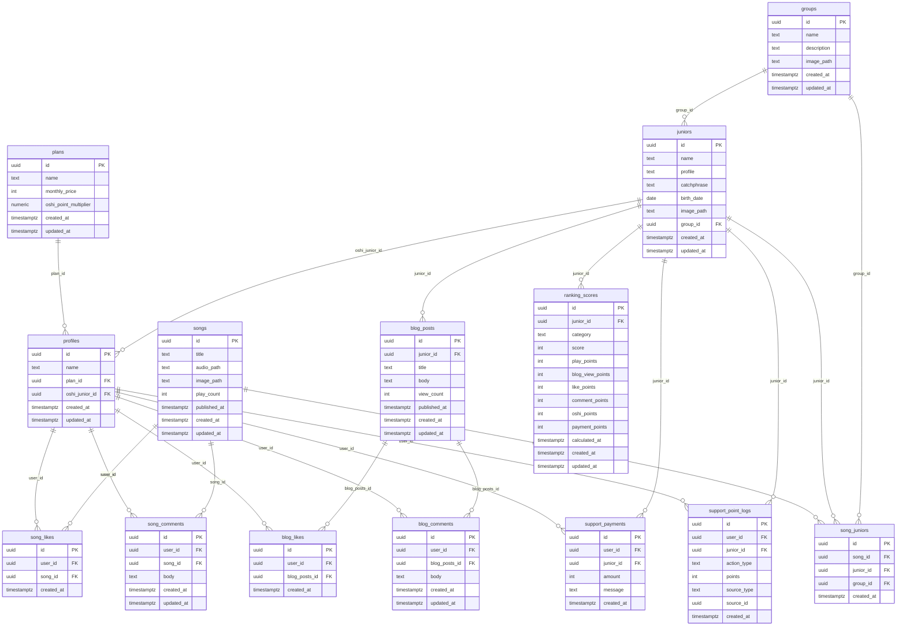

# MUSIC FRONTLINE ER図・テーブル関連図

## ER図



## テーブル関連図（簡易版）

全体像をざっくり把握するための簡易図です。

```mermaid
flowchart LR
    subgraph 認証・ユーザー
        AUTH["auth.users<br/>(Supabase Auth)"]
        PROF[profiles]
        PLAN[plans]
    end

    subgraph アーティスト
        GRP[groups]
        JR[juniors]
    end

    subgraph 楽曲
        SONG[songs]
        SJ[song_juniors]
        SL[song_likes]
        SC[song_comments]
    end

    subgraph ブログ
        BP[blog_posts]
        BL[blog_likes]
        BC[blog_comments]
    end

    subgraph 応援・ランキング
        SP[support_payments]
        SPL[support_point_logs]
        RS[ranking_scores]
    end

    AUTH -->|トリガーで自動作成| PROF
    PLAN -->|plan_id| PROF
    JR -->|oshi_junior_id| PROF
    GRP -->|group_id| JR

    SONG --- SJ --- JR
    PROF -->|user_id| SL
    SONG -->|song_id| SL
    PROF -->|user_id| SC
    SONG -->|song_id| SC

    JR -->|junior_id| BP
    PROF -->|user_id| BL
    BP -->|blog_posts_id| BL
    PROF -->|user_id| BC
    BP -->|blog_posts_id| BC

    PROF -->|user_id| SP
    JR -->|junior_id| SP
    PROF -->|user_id| SPL
    JR -->|junior_id| SPL
    JR -->|junior_id| RS
```

## テーブル一覧（用途別）

| カテゴリ | テーブル | 説明 |
|---|---|---|
| **マスタ** | `plans` | 課金プラン（フリー/スタンダード/プレミアム） |
| **マスタ** | `groups` | グループ |
| **マスタ** | `juniors` | ジュニア（アーティスト） |
| **ユーザー** | `profiles` | ユーザープロフィール（auth.users と 1:1） |
| **楽曲** | `songs` | 楽曲 |
| **楽曲** | `song_juniors` | 楽曲 ↔ ジュニア 中間テーブル |
| **楽曲** | `song_likes` | 楽曲いいね（UNIQUE: user_id + song_id） |
| **楽曲** | `song_comments` | 楽曲コメント |
| **ブログ** | `blog_posts` | ブログ記事 |
| **ブログ** | `blog_likes` | ブログいいね（UNIQUE: user_id + blog_posts_id） |
| **ブログ** | `blog_comments` | ブログコメント |
| **応援** | `support_payments` | 応援課金（投げ銭） |
| **応援** | `support_point_logs` | 応援ポイントログ |
| **ランキング** | `ranking_scores` | ランキングスコア（UNIQUE: junior_id + category） |

## RPC 関数

| 関数名 | 引数 | 説明 |
|---|---|---|
| `increment_play_count` | `song_id: uuid` | 楽曲の再生回数を +1（競合安全） |
| `increment_blog_view` | `blog_id: uuid` | ブログの閲覧数を +1（競合安全） |

## トリガー

| トリガー名 | 対象 | タイミング | 説明 |
|---|---|---|---|
| `on_auth_user_created` | `auth.users` | AFTER INSERT | 新規ユーザー登録時に `profiles` を自動作成 |
